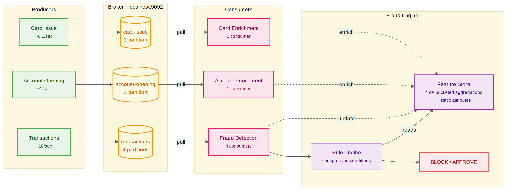

# Kafka Realtime Fraud Engine

A real-time fraud detection pipeline built on a custom Kafka implementation. The Kafka broker, binary protocol, feature store, and rule engine are all written from scratch in Python.



## Kafka

A TCP server with a binary protocol that persists messages to append-only partition files on disk. Producers write to topics, consumers pull from them. Consumer groups handle partition assignment so each partition is processed by one consumer.

## Fraud Engine

The feature store maintains customer profiles through a unified config. Time-bucketed features (`sum`, `count`, `unique`) track transaction patterns over rolling windows. Static features (`latest`) capture attributes from enrichment topics like account age or card type. Both types go through the same pipeline.

The rule engine evaluates conditions against the customer's profile and the current transaction. Decisions are BLOCK or APPROVE.

## Test Environment

Three producers simulate a banking environment with Poisson-distributed event rates. 100 customers, 5% fraudsters. The consumer script starts 4 fraud detection consumers and 2 enrichment consumers sharing one in-memory feature store.

## Run

```bash
./start.sh
```

Or separately:
```
python tests/start_broker.py
python tests/produce_transactions.py
python tests/produce_account_openings.py
python tests/produce_card_issues.py
python tests/start_consumers.py
```

